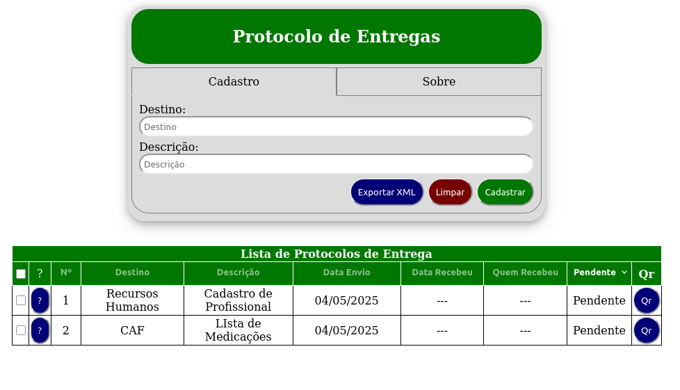

# Protocolo de Entregas

    Trata-se do aplicativo simples de uso em navegadores para registro de protocolos de entrega em ambiente Desktop. Os dados são armazenados no navegador de sua preferência.

1. Faça download do projeto em seu computador.
2. Extraia o arquivo, se necessário.
3. Execute o arquivo protocolo-de-entregas.html.
4. Registre Protocolos, informando Destino e Descrição.
5. Faça download do aplicativo android no link descrito abaixo.
6. Exporte protocolos de entrega por meio de leitura do Código QR.

Link APP Mobile: https://play.google.com/store/apps/details?id=com.wk.protocolodeentrega.

Desenvolvido em HTML, CSS e Javascript com armazenamento em indexDB.

    O aplicativo está sob a Licença MIT e fez uso de biblioteca de terceiros para gerar QR Codes, conforme descrito abaixo.

This project includes code from:

* **qrcode.min.js:** Copyright (c) 2020 datalog.
  Licensed under MIT License.
  Link: https://github.com/datalog/qrcode-svg